# T-Bank Translator

## Описание проекта

Данный проект представляет собой выполнение лабораторной работы по Java для курса Java-разработчик, осень 2024.

## Пререквизиты

* Java 17
* Maven
* Spring Boot 3
* Docker

## Использование

Для начала работы с проектом, потребуется получить API ключ для переводчика на сайте [Yandex Cloud](https://cloud.yandex.ru).

### Как получить ключ?

1. Пройдите аутентификацию через Yandex ID.
2. После входа у вас создастся облако и дефолтный каталог. Скопируйте ID вашего каталога и сохраните его в удобное место — он вам понадобится.
   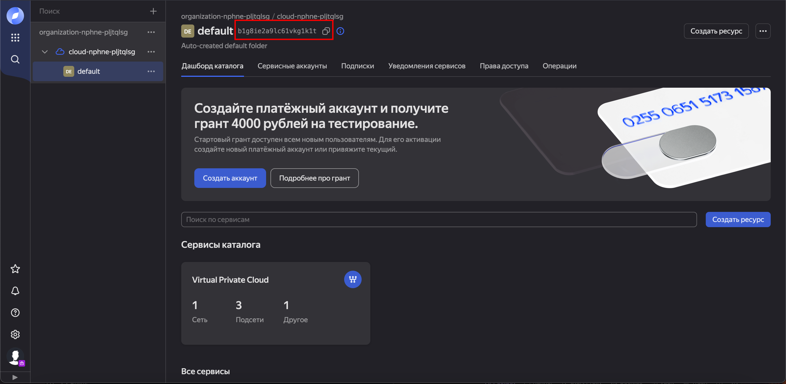
4. Перейдите во вкладку “Сервисные аккаунты”, нажмите на троеточие слева и выберите “Создать сервисный аккаунт”.
   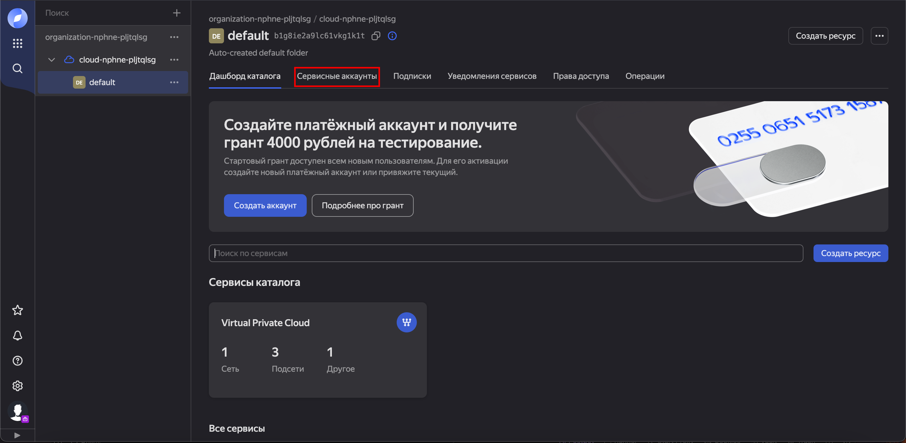
   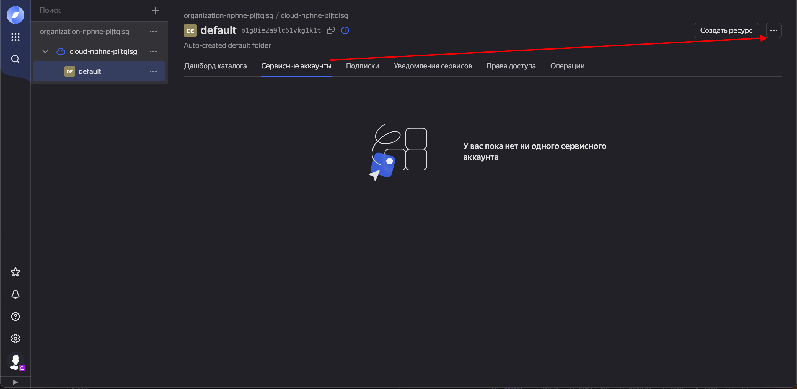
   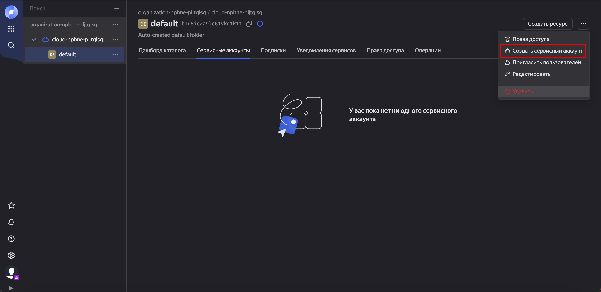
    * Заполните данные и в поле "роль" выберите `ai.translate.user` (это и будет роль переводчика Яндекса), затем нажмите "Создать".
    * 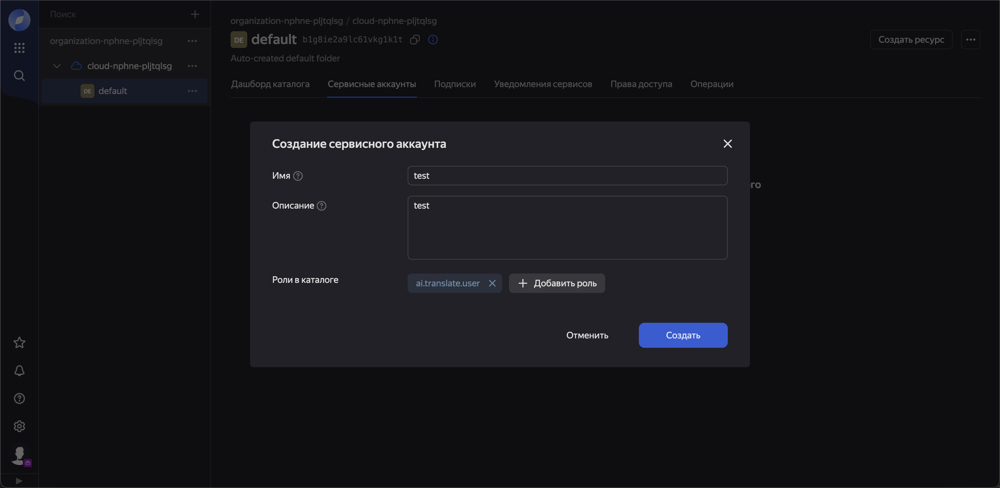
6. Создайте платежный аккаунт для использования сервисов Yandex Cloud. (Если у вас его нет)
    * Заполните информацию в соответствии с вашими данными. Yandex Cloud является бесплатным при соблюдении квот и лимитов, подробнее об этом можно почитать [здесь](https://cloud.yandex.ru/docs/billing/overview).
   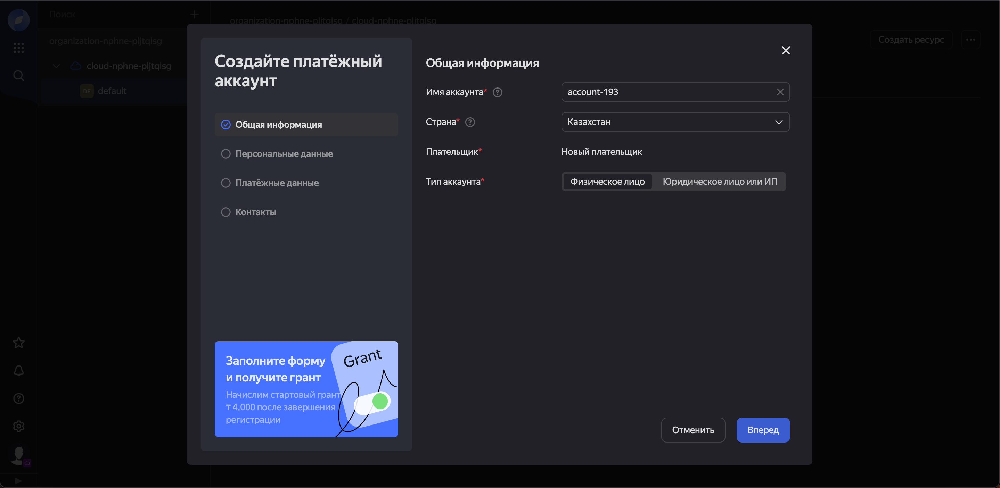

8. После создания сервисного аккаунта, перейдите на его страницу.
   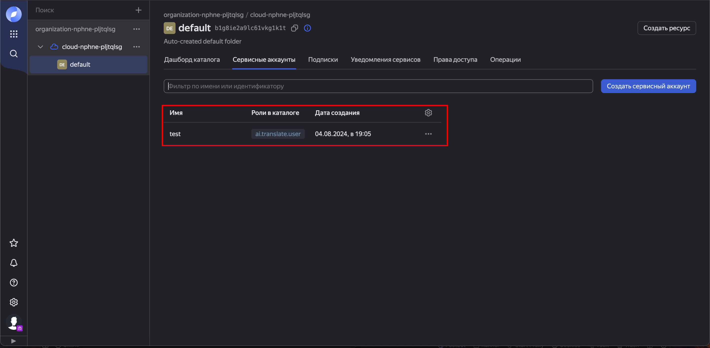
   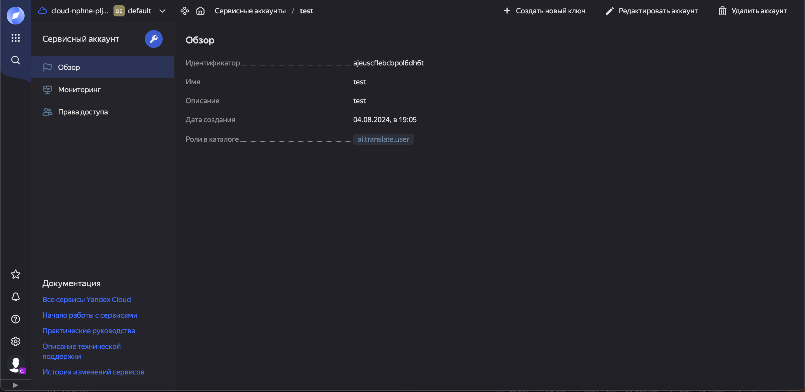
10. Сгенерируйте API ключ:
    * Нажмите "Создать новый ключ" и выберите "Создать API-ключ".
    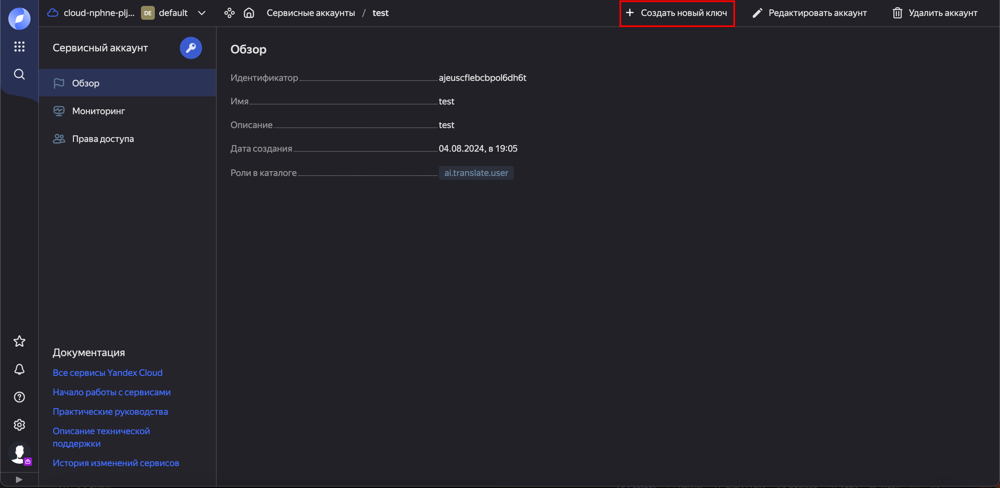
    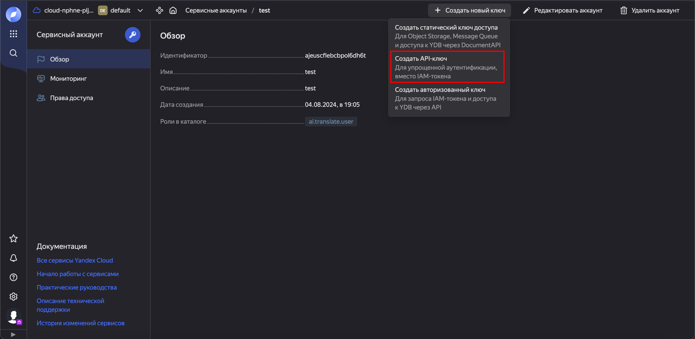
    * Сохраните идентификатор и ключ в удобное место. После закрытия окна ключ будет недоступен для просмотра.
    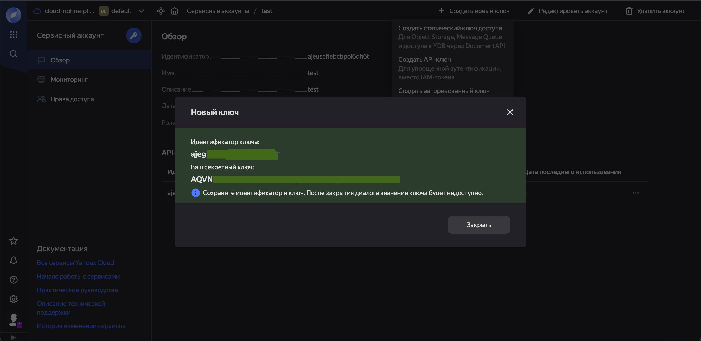
Теперь вы готовы использовать API ключ для работы с проектом.

## Настройка API ключа и Folder ID:

   Перейдите в файл application.properties в папке src/main/resources и измените значения для folderID и api-key:
   ```bash
   yandex.translate.folder-id=ВАШ_FOLDER_ID
   yandex.translate.api-key=ВАШ_API_KEY
   ```
## Запуск программы

Для удобства работы с Docker был написан `Makefile`, который содержит команды для управления Docker-контейнерами. Для запуска проекта и работы с Docker-контейнерами выполните следующие шаги:

1. **Сборка и установка проекта:**

   Выполните следующую команду для сборки проекта, установки зависимостей и создания Docker-образов:

   ```bash
   make launch

2. **Запуск контейнеров:**

   Для запуска Docker-контейнеров используйте команду:
   ```bash
   make up

3. **Запуск сгенерированного Swagger UI:**

После запуска контейнеров вы можете получить доступ к Swagger UI, который предоставляет интерфейс для взаимодействия с API. Swagger UI доступен по следующему URL: http://localhost:8080/swagger-ui.html (порт может отличаться в зависимости от вашей конфигурации).
